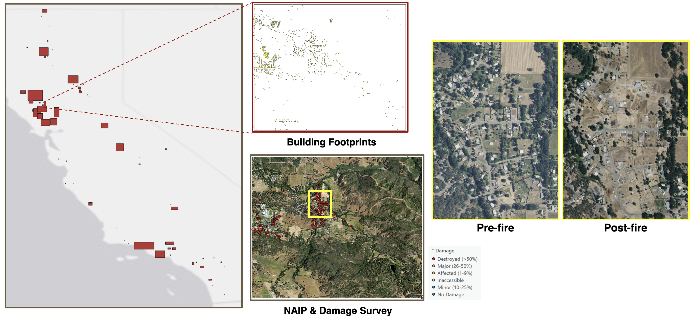
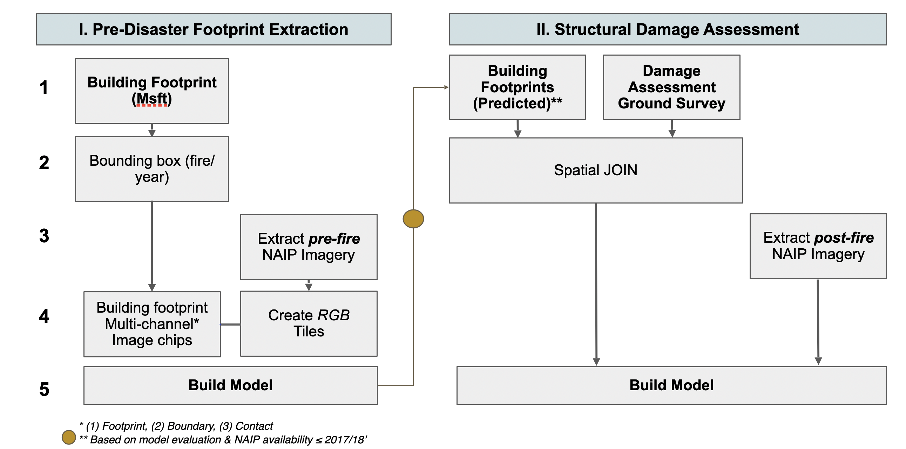
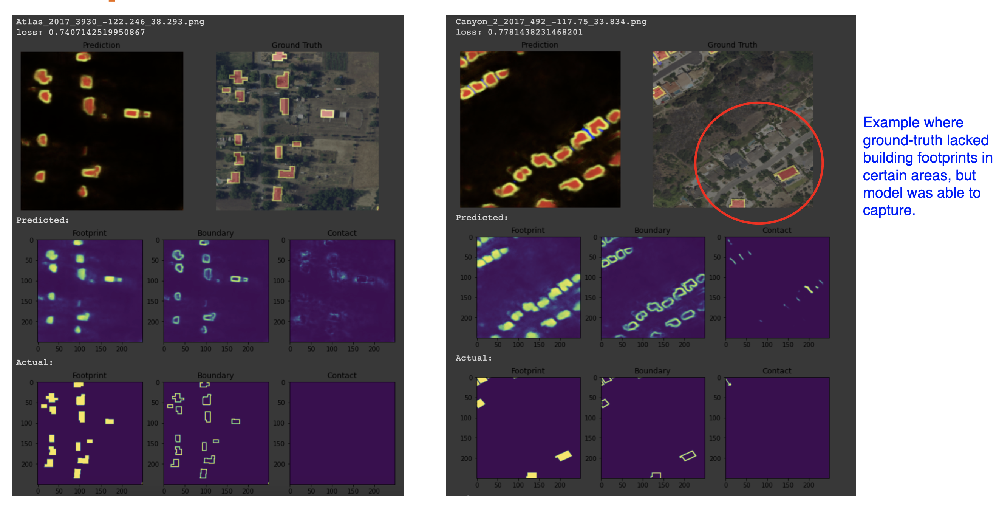
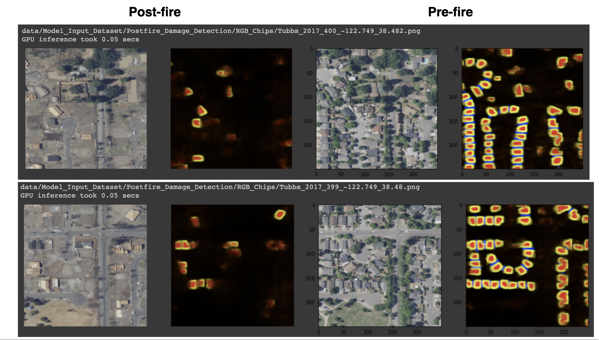
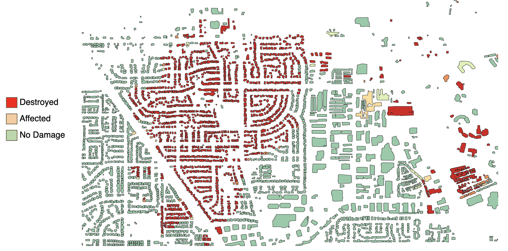

# Building Extraction using U-Net Semantic Segmentation Model for Pre/Post Disaster Monitoring

## Table of Contents  
- [Project Description](#project-Description)  
- [Datasets](#datasets)  
- [Workflow](#workflow)  
- [Preliminary Results](#preliminary-results) 

## Project Description 

--

## Datasets 

<figure class="image">
  
  <figcaption>Figure 1. Comparison of possible training dataset for building extraction workflow in Napa County.</figcaption>
</figure>

<figure class="image">
  
  <figcaption>Figure2. Boundaries of fires across CA that will be used as training/testing dataset for building polygons and pre-/post- disaster NAIP imagery. </figcaption>
</figure>

<figure class="image">
  
  <figcaption>Figure 3. Example of post-fire stuctural damage and loss for 2018 Camp fire in Paradise, CA.</figcaption>
</figure>

## Workflow 

<figure class="image">
  
  <figcaption>Figure 4. Overview of high-level workflow and project objectives. </figcaption>
</figure>

## Preliminary Results 

<figure class="image">
  
  <figcaption>Figure5. Predicted building polygons for pre-/post- fire. Example shows model correctly detected building, contrary to training dataset. </figcaption>
</figure>

<figure class="image">
  
  <figcaption>Figure6. Predicted building polygons for pre-/post- fire.  </figcaption>
</figure>

<figure class="image">
  
  <figcaption>Figure7. Comparison between ground-truth and predicted building polygons. Colors representing true and false postives/negatives. </figcaption>
</figure>

<figure class="image">
  
  <figcaption>Figure8. Map of predicted building polygon with spatial joined structural damage survey data taken post-fire. </figcaption>
</figure>